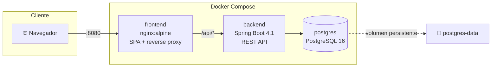

# 🛒 TGS E-commerce Challenge

[](https://github.com/dandresgranados/ecommerce-challenge/actions/workflows/backend-ci.yml)
[](https://github.com/dandresgranados/ecommerce-challenge/actions/workflows/frontend-ci.yml)
[](https://github.com/dandresgranados/ecommerce-challenge/actions/workflows/docker-build.yml)
[](https://adoptium.net/temurin/releases/?version=17)
[](https://spring.io/projects/spring-boot)
[](https://angular.dev)
[](LICENSE)

Aplicación de e-commerce full-stack construida como reto técnico para **TGyS**.
Incluye MVP funcional (autenticación, catálogo, carrito, órdenes, reportes,
auditoría) y las reglas de negocio de descuentos combinables.

---

## 📋 Índice

- [Alcance del reto](#-alcance-del-reto)
- [Stack tecnológico](#-stack-tecnológico)
- [Arquitectura](#-arquitectura)
- [Reglas de negocio](#-reglas-de-negocio)
- [Arranque rápido](#-arranque-rápido)
- [Credenciales seed](#-credenciales-seed)
- [Endpoints principales](#-endpoints-principales)
- [Testing](#-testing)
- [CI/CD](#-cicd)
- [Estructura del proyecto](#-estructura-del-proyecto)
- [Convenciones](#-convenciones)

---

## 🎯 Alcance del reto

El reto pide un **MVP funcional** con estas capacidades:

| # | Requerimiento | Estado |
|---|---|---|
| a | Login | ✅ JWT (jjwt) persistido en localStorage |
| b | Creación de usuarios (público) | ✅ `POST /api/auth/register` |
| c | Gestión de usuarios (admin) | ✅ CRUD + cambio de contraseña |
| d | CRUD sobre entidad principal (Productos) | ✅ Products + Categories + Inventory |
| e | 3 reportes | ✅ Productos activos, top 5 vendidos, top 5 clientes frecuentes |
| f | Búsqueda de productos | ✅ Por nombre, categoría, rango de precio, estado |
| g | Auditoría | ✅ 9 tipos de eventos: LOGIN, LOGIN_FAILED, REGISTER, CREATE, UPDATE, DELETE, PASSWORD_CHANGE, PAY, CANCEL |

Requisitos técnicos:

| Requisito | Solución aplicada |
|---|---|
| Reglas de descuento combinables | 10 % GLOBAL + 50 % RANDOM + 5 % cliente frecuente = hasta 60 % |
| Git con Conventional Commits | ✅ [Ver historial](../../commits/main) |
| Documentación en Markdown | ✅ Este README + `backend/README.md` + `frontend/README.md` + `DEMO.md` |
| Pruebas unitarias | ✅ 24 backend (JUnit 5 + Mockito) + 32 frontend (Vitest) |
| CI/CD | ✅ GitHub Actions (backend, frontend, docker) |
| Containerización | ✅ Docker multi-stage + Docker Compose |
| Análisis estático | ✅ JaCoCo, SpotBugs, Checkstyle, ESLint, Prettier |

---

## 🛠️ Stack tecnológico

### Backend

- **Java 17 (LTS)** con Spring Boot **4.1.0**
- **Spring Security 6** + **JWT** (jjwt 0.12.6)
- **Spring Data JPA** + Hibernate 7
- **H2** en memoria (dev) / **PostgreSQL 16** (prod)
- **Lombok** para boilerplate
- **JaCoCo 0.8.12** + **SpotBugs 4.8** + **Checkstyle 3.6**
- **JUnit 5** + Mockito + AssertJ + MockMvc

### Frontend

- **Angular 21** con **standalone components** y **Signals**
- **Angular Material 21** (tema Azure Blue)
- **RxJS** + **TypeScript 5.9** (strict)
- **Vitest 4** con coverage v8
- **ESLint 9** (flat config) + **Prettier 3**

### Infraestructura

- **Docker** multi-stage builds
- **Docker Compose** (3 servicios: postgres + backend + frontend)
- **nginx** como reverse proxy + SPA server
- **GitHub Actions** (3 workflows) + **Dependabot** semanal

---

## 🏗️ Arquitectura



### Capas del backend (por dominio)

```
com.tgs.ecommerce
├── audit/           ← registros de auditoría
├── common/          ← AuditableEntity, GlobalExceptionHandler
├── config/          ← DataInitializer, JpaAuditingConfig
├── order/           ← Orders, DiscountWindows, DiscountCalculator
├── product/         ← Products, Categories, Inventory
├── report/          ← 3 reportes (interface projections)
├── security/        ← JwtTokenProvider, JwtAuthenticationFilter, SecurityConfig
└── user/            ← Users, Roles, AuthController
```

### Capas del frontend

```
src/app/
├── core/            ← singletons (services, guards, interceptors, models)
├── shared/          ← componentes reutilizables (dialogs, pipes)
├── layout/          ← shell con MatSidenav + toolbar + badge carrito
└── features/        ← rutas lazy-loaded (auth, products, orders, reports, admin)
```

---

## 💰 Reglas de negocio

### Descuentos combinables

El precio final de una orden se calcula como:

```
total = subtotal × (1 - descuentoTotal)
descuentoTotal = min(0.95, global + random + fidelidad)
```

| Descuento | % | Cuándo aplica |
|---|---|---|
| **GLOBAL** | 10 % | Existe una `DiscountWindow` tipo `GLOBAL` activa en el momento de la orden |
| **RANDOM** | 50 % | El usuario marcó el toggle "pedido aleatorio" **Y** hay una `DiscountWindow` tipo `RANDOM` activa |
| **Cliente frecuente** | 5 % | El usuario tiene ≥ 5 órdenes en los últimos 30 días (configurable) |

**Ejemplo real** (verificado con Playwright):

```
Auriculares Bluetooth  $149.99
Teclado mecánico        $89.50
──────────────────────────────
Subtotal:              $239.49
Descuento total (60%): $143.69
──────────────────────────────
TOTAL:                  $95.80
```

### Otras reglas

- **Soft delete** de productos: al "eliminar" se marca `active=false`. Preserva histórico de órdenes.
- **Snapshot de precio**: al crear una orden se guarda el precio del producto en ese instante. Si el admin cambia el precio después, la orden histórica no se altera.
- **Stock**: se decrementa al crear orden. Se **devuelve** al cancelar.
- **Optimistic locking** con `@Version` para evitar race conditions en `Order` e `Inventory`.

---

## 🚀 Arranque rápido

### Opción A — Con Docker Compose (recomendado)

Requiere solo **Docker Desktop**. Un único comando levanta backend + frontend + PostgreSQL:

```powershell
git clone https://github.com/dandresgranados/ecommerce-challenge.git
cd ecommerce-challenge

# Crear archivo de entorno (edita JWT_SECRET si vas a producción)
copy .env.example .env

# Levantar toda la stack
docker compose up --build
```

Abre → **http://localhost:8080**

Para parar: `docker compose down` (los datos persisten).
Para borrar todo incluida la BD: `docker compose down -v`.

### Opción B — Desarrollo local

Requiere **JDK 17**, **Node 22** y **npm 10**.

**Terminal 1 — Backend**:

```powershell
cd backend
$env:SPRING_PROFILES_ACTIVE = 'dev'
.\mvnw.cmd spring-boot:run
```

API disponible en → `http://localhost:8080/api`

**Terminal 2 — Frontend**:

```powershell
cd frontend
npm install
npm start
```

UI disponible en → `http://localhost:4200`

El dev-server de Angular proxya `/api/*` al backend automáticamente
(ver [frontend/proxy.conf.json](frontend/proxy.conf.json)).

---

## 🔑 Credenciales seed

Al arrancar, el `DataInitializer` crea si no existen:

| Usuario | Contraseña | Roles |
|---|---|---|
| `admin` | `admin123` | ADMIN, USER |
| `user` | `user123` | USER |

Y dos ventanas de descuento activas (válidas por 1 año):

- **GLOBAL** — 10 %
- **RANDOM** — 50 %

⚠️ En un despliegue real, cambia las contraseñas y el `JWT_SECRET` de
[.env.example](.env.example).

---

## 📡 Endpoints principales

Toda la API tiene el prefijo `/api`. Los endpoints protegidos requieren
`Authorization: Bearer <token>` obtenido de `/api/auth/login`.

### Auth (público)

| Método | Ruta | Descripción |
|---|---|---|
| POST | `/api/auth/login` | Login con `{ username, password }` → JWT |
| POST | `/api/auth/register` | Registro público (rol USER) |
| GET  | `/api/auth/me` | Usuario del token actual |

### Productos y Categorías

| Método | Ruta | Rol | Descripción |
|---|---|---|---|
| GET  | `/api/products` | Auth | Búsqueda paginada `?name=&categoryId=&minPrice=&maxPrice=&active=&page=&size=&sort=` |
| GET  | `/api/products/{id}` | Auth | Detalle |
| POST | `/api/products` | ADMIN | Crear |
| PUT  | `/api/products/{id}` | ADMIN | Actualizar |
| DELETE | `/api/products/{id}` | ADMIN | Soft delete |
| GET/POST/PUT/DELETE | `/api/categories` | GET auth, resto ADMIN | CRUD de categorías |

### Órdenes

| Método | Ruta | Descripción |
|---|---|---|
| POST | `/api/orders` | Crear (calcula descuentos + decrementa stock) |
| GET  | `/api/orders/my` | Historial del usuario autenticado |
| GET  | `/api/orders/{id}` | Detalle con desglose completo |
| POST | `/api/orders/{id}/pay` | Marcar como pagada |
| POST | `/api/orders/{id}/cancel` | Cancelar (devuelve stock) |

### Reportes (ADMIN)

| Método | Ruta | Descripción |
|---|---|---|
| GET | `/api/reports/products/active` | Todos los productos activos |
| GET | `/api/reports/products/top-selling?limit=5` | Top N por unidades vendidas |
| GET | `/api/reports/customers/frequent?limit=5` | Top N por número de órdenes |

### Auditoría (ADMIN)

| Método | Ruta | Descripción |
|---|---|---|
| GET | `/api/audit-logs` | Consulta con filtros `?action=&entityType=&entityId=&performedBy=&from=&to=` |

### Ejemplos rápidos con curl

```bash
# 1. Login
curl -X POST http://localhost:8080/api/auth/login \
  -H "Content-Type: application/json" \
  -d '{"username":"admin","password":"admin123"}'
# → { "token": "eyJ...", "user": {...}, ... }

# 2. Crear orden con pedido aleatorio
TOKEN="eyJ..."
curl -X POST http://localhost:8080/api/orders \
  -H "Authorization: Bearer $TOKEN" \
  -H "Content-Type: application/json" \
  -d '{
    "items": [{"productId":1,"quantity":2}],
    "randomOrder": true
  }'
# → total con 60 % de descuento
```

Para un flujo completo end-to-end, ver [DEMO.md](DEMO.md).

---

## 🧪 Testing

### Backend (24 tests)

```powershell
cd backend
.\mvnw.cmd test              # Solo tests
.\mvnw.cmd verify            # Tests + JaCoCo + SpotBugs + Checkstyle
```

Reporte de cobertura HTML: `backend/target/site/jacoco/index.html`

### Frontend (32 tests)

```powershell
cd frontend
npm test                     # Modo watch
npm run test:ci              # Una pasada con coverage
```

Reporte HTML: `frontend/coverage/index.html`

Cobertura actual del frontend:

| Métrica | Valor |
|---|---|
| Statements | **91.97 %** |
| Branches | **89.9 %** |
| Functions | **92.85 %** |
| Lines | **93.27 %** |

---

## 🤖 CI/CD

Tres workflows en `.github/workflows/`:

| Workflow | Cuándo | Jobs |
|---|---|---|
| [backend-ci.yml](.github/workflows/backend-ci.yml) | Cambios en `backend/**` | build-and-test + static-analysis |
| [frontend-ci.yml](.github/workflows/frontend-ci.yml) | Cambios en `frontend/**` | lint + test + build |
| [docker-build.yml](.github/workflows/docker-build.yml) | Cambios en Dockerfiles | build-backend + build-frontend |

Los reportes de coverage, JAR y `dist/` quedan como **artefactos descargables**
desde la pestaña Actions durante 14 días.

**Dependabot** revisa dependencias semanalmente y abre PRs con los bumps
(configurado en [.github/dependabot.yml](.github/dependabot.yml)).

---

## 📁 Estructura del proyecto

```
ecommerce-challenge/
├── .github/
│   ├── workflows/           ← 3 pipelines de GitHub Actions
│   └── dependabot.yml
├── backend/                 ← Spring Boot 4
│   ├── src/
│   │   ├── main/java/       ← 9 dominios: audit, common, config, order, product, report, security, user
│   │   ├── main/resources/  ← application*.yml + data.sql
│   │   └── test/            ← 24 tests unitarios
│   ├── Dockerfile           ← multi-stage: maven builder → JRE runtime
│   ├── checkstyle.xml
│   ├── spotbugs-exclude.xml
│   └── pom.xml
├── frontend/                ← Angular 21
│   ├── src/app/
│   │   ├── core/            ← services/guards/interceptors/models singleton
│   │   ├── shared/          ← componentes reutilizables
│   │   ├── layout/          ← shell con sidenav
│   │   └── features/        ← auth, products, orders, reports, admin (lazy)
│   ├── src/environments/    ← environment.ts (prod) + environment.development.ts
│   ├── Dockerfile           ← multi-stage: node builder → nginx runtime
│   ├── nginx.conf           ← SPA + proxy /api → backend
│   ├── eslint.config.mjs
│   └── package.json
├── docker-compose.yml       ← 3 servicios con healthchecks + volumen persistente
├── .env.example
├── README.md                ← este archivo
├── DEMO.md                  ← guion de demostración
└── CONTRIBUTING.md          ← convenciones de contribución
```

---

## 📝 Convenciones

### Commits (Conventional Commits)

```
<tipo>(<scope opcional>): <descripción corta>

<cuerpo opcional con detalles>
```

Tipos usados: `feat`, `fix`, `chore`, `docs`, `test`, `refactor`, `ci`, `build`.

Ejemplos reales del historial:

```
feat(frontend): dashboard de reportes con top vendidos y clientes frecuentes
fix(ci): repair backend test isolation and Docker build
chore(deps-frontend): bump @angular/material to 21.2.15
```

Ver [CONTRIBUTING.md](CONTRIBUTING.md) para el flujo completo de PRs.

---

## 📄 Licencia

MIT — ver [LICENSE](LICENSE).

---

## 👤 Autor

**Diego Andrés Granados** — Reto técnico para **TGyS**.
