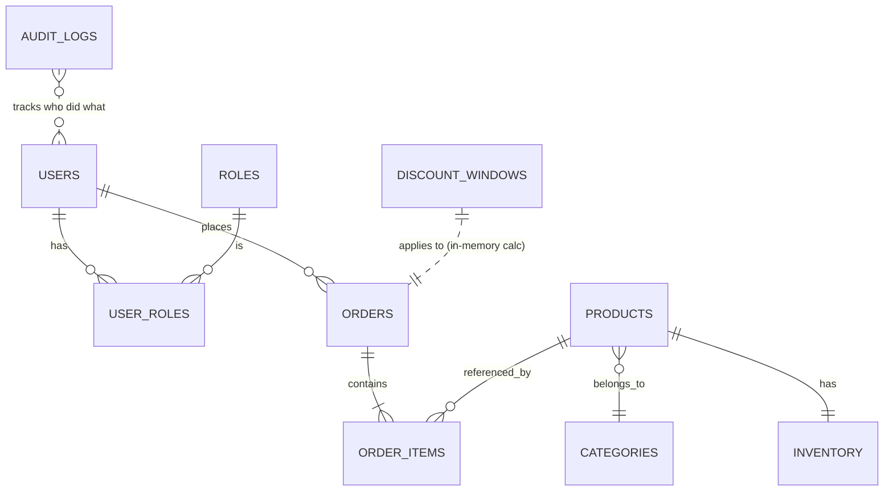

# Backend — TGS E-commerce

REST API en **Spring Boot 4.1** con **Java 17**, **JWT** y **PostgreSQL** (prod)
/ **H2** (dev).

> Para la visión general del proyecto ver el [README raíz](../README.md).

## 🚀 Arranque local

```powershell
$env:SPRING_PROFILES_ACTIVE = 'dev'
.\mvnw.cmd spring-boot:run
```

La API queda en `http://localhost:8080/api`.

Consola H2 (solo en dev): http://localhost:8080/h2-console
- JDBC URL: `jdbc:h2:mem:ecommerce`
- User: `sa` / Password: *(vacío)*

## 📦 Perfiles

| Perfil | BD | DDL | `data.sql` | Consola H2 |
|---|---|---|---|---|
| `dev` (default) | H2 en memoria | `create-drop` | ✅ | ✅ |
| `prod` | PostgreSQL | `update` | ❌ | ❌ |

Activar prod: `SPRING_PROFILES_ACTIVE=prod` + variables `DATABASE_URL`,
`DATABASE_USERNAME`, `DATABASE_PASSWORD`, `JWT_SECRET`.

## 🧪 Tests

```powershell
.\mvnw.cmd test                # Solo tests
.\mvnw.cmd verify              # Tests + JaCoCo + SpotBugs + Checkstyle
.\mvnw.cmd checkstyle:check    # Solo estilo
.\mvnw.cmd spotbugs:check      # Solo bugs
```

**24 tests** cubriendo la lógica crítica:

| Suite | Tests | Alcance |
|---|---|---|
| `DiscountCalculatorTest` | 8 | Las 3 reglas y combinaciones |
| `OrderNumberGeneratorTest` | 3 | Formato ORD-YYYY-XXXXXXXX + unicidad |
| `ProductServiceTest` | 5 | CRUD + soft-delete + specifications |
| `ProductRepositoryTest` | 3 | Slice `@DataJpaTest` con auditing |
| `AuthControllerTest` | 4 | Login OK/KO + register + `/me` |
| `EcommerceApiApplicationTests` | 1 | Context loads |

Reportes:

- Cobertura: `target/site/jacoco/index.html`
- SpotBugs: `target/spotbugsXml.xml` (o `mvn site` para HTML)
- Checkstyle: en consola durante el build

## 🏗️ Estructura por dominio

Se sigue el patrón **package-by-feature** (no por capa técnica), donde cada
dominio es autocontenido:

```
com.tgs.ecommerce/
├── audit/
│   ├── controller/AuditLogController.java
│   ├── domain/AuditLog.java + AuditAction.java
│   ├── dto/
│   ├── repository/AuditLogRepository.java (con Specifications)
│   └── service/AuditService.java
├── common/
│   ├── domain/AuditableEntity.java     ← superclase con @CreatedDate, etc.
│   ├── exception/GlobalExceptionHandler.java
│   └── util/
├── config/
│   ├── DataInitializer.java             ← seed users + discount windows
│   ├── JpaAuditingConfig.java           ← @EnableJpaAuditing + AuditorAware
│   └── SecurityConfig.java
├── order/
│   ├── controller/OrderController.java + DiscountWindowController.java
│   ├── domain/Order + OrderItem + DiscountWindow
│   ├── dto/
│   └── service/OrderService + DiscountCalculator + OrderNumberGenerator
├── product/
│   ├── controller/ProductController.java + CategoryController.java
│   ├── domain/Product + Category
│   ├── dto/ (ProductRequest, ProductResponse, ProductSearchCriteria)
│   ├── repository/ProductRepository (con Specifications)
│   └── service/ProductService + Mappers
├── inventory/
│   └── domain/Inventory.java            ← relación 1:1 con Product
├── report/
│   ├── controller/ReportController.java
│   ├── dto/                             ← Interface Projections
│   └── service/ReportService.java
├── security/
│   ├── JwtTokenProvider.java
│   ├── JwtAuthenticationFilter.java
│   ├── JwtProperties.java (@ConfigurationProperties)
│   └── CustomUserDetails.java
└── user/
    ├── controller/AuthController.java + UserController.java
    ├── domain/User + Role + RoleName
    ├── dto/
    └── service/AuthService + UserService
```

## 🔒 Seguridad

- **JWT firmado con HS384** — secret configurable via `JWT_SECRET`
- **BCrypt** para las contraseñas
- **CORS** manejado por nginx en producción (no hace falta en el backend)
- **`@PreAuthorize`** a nivel de método en endpoints ADMIN
- **`@AuthenticationPrincipal`** inyecta el username del token en los controllers
- **Auditoría automática** de LOGIN, LOGIN_FAILED, CREATE, UPDATE, DELETE, PAY, CANCEL

## 🗄️ Modelo de datos



## 📚 Referencias útiles

- [Spring Boot 4 reference](https://docs.spring.io/spring-boot/reference/)
- [Spring Security JWT](https://docs.spring.io/spring-security/reference/servlet/oauth2/resource-server/jwt.html)
- [jjwt](https://github.com/jwtk/jjwt)
